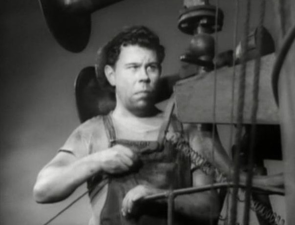
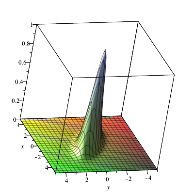
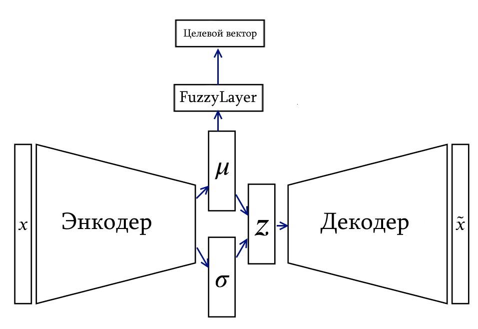
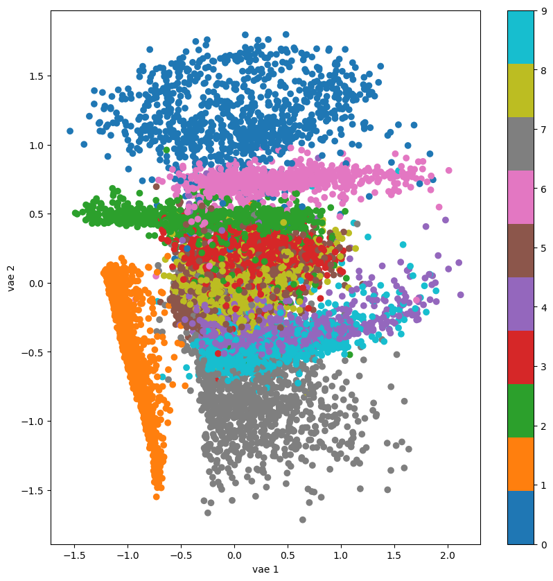
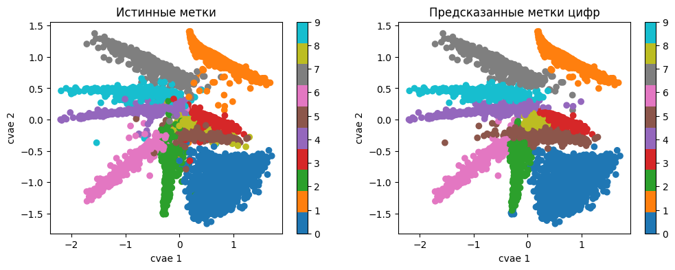

# Варим кашу из нечеткой логики и вариационных автоэнкодеов

Пока весь мир затаив дыхание следит за большими языковыми моделями и одни грезят о том, как подсадят всех на свои сервисы LLM, а другие прикидывают как можно заменить бездушными симулякрами если не зажравшихся айтишников, то хотя бы женщин и бухгалтеров, то обычным машинистам по щиколотку в коричневой жиже дипленинга приходится решать приземлемые задачи чуть ли не первобытными средствами.



Когда перед нашей командой появилась очередная _интересная_ задача из разряда "сделайте из датасета картинок с исправными пружинами детектор неисправных амортизационных комплексов", а из подручных средств только бытовые видеокарты да джентльменский набор сеток yolo, мы начали искать способы, как упростить себе жизнь хотя бы с разметкой данных.
И пришли к идее использования элементов нечеткой логики в связке с вариационными энкодерами (VAE) для целого круга задач, связанных не только с разметкой.

Но начнем с небольшого лирического вступления.

Когда то давным давно, когда вариационные автоэнкодеры только только вышли на сцену, это было потрясающе. Казалось, что наконец-то нейронные сети смогут извлекать знание из данных, представляя их в виде параметризированных моделей, прямо как это делают в формулах физики\математики!
Воображение рисовало возможности легким движением руки отращивать волосы нужной длины на фотографиях людей, извлекать из тензометрических данных температурные параметры, сжимать покерные руки в эффективные бакеты малой размерности и надирать всем зад, но...

](fig1.png)

_Картинка из [Understanding disentangling in β-VAE](https://arxiv.org/abs/1804.03599). Разве не шок?_

Реальность оказалась щедрой на сложности и разочарования.
Чистая VAE даже в продвинутой реализации [$\beta$-VAE](https://www.semanticscholar.org/paper/beta-VAE%3A-Learning-Basic-Visual-Concepts-with-a-Higgins-Matthey/a90226c41b79f8b06007609f39f82757073641e2?p2df) выдает набор латентных признаков, интерпретация которых требует их перебора в некоторой заранее неизвестной области определения и _экспертного_ мнения для отслеживания правильности того, правильно ли шевелится ли там на выходе то, что вы шевелите тут.

Процедура по задумке должна выглядеть так: покрутил параметр и увидел, что у стульчик на картинке завращался в ответ?
Отлично, параметр вращения.
Изменил другой параметр - размер стульчика начал меняться?
Шикарно.
И так до посинения.
А если обучил модель с нуля заново, то и процедуру разбора параметров начинай заново.

Эта процедура не является особой проблемой, если задача довольно простая и не требует познаний в предметной области, рабочее время бесплатное, а вычислительное время бесконечное.

Реальные задачи, чем дальше от привычных обывателю вещей, тем сильнее завязаны на экспертные знания (читай разметку), которых всегда мало.
Ну а раз без разметки не обойтись, то почему бы саму модель и не выдрессировать работать с этими данными?

Так появились расширенные вариационые автоэнкодеры([Conditional Variational Autoencoder, CVAE](https://proceedings.neurips.cc/paper/2015/file/8d55a249e6baa5c06772297520da2051-Paper.pdf), которые вместе с задачей реконструкции и сжатия признаков решают еще и задачу классификации.

Положа руку на сердце, стоит признать что CVAE с полносвязными слоями в качестве классификаторов уступают и классификаторам и чистым VAE.
Просто потому что первым не надо заморачиваться с реконструкцией, а вторым не нужно тесниться на многообразии в латентном пространстве с конкурентами за топологию.

Какие преимущества дает CVAE?

Если посмотреть на [некоторые реализации CVAE](https://github.com/nnormandin/Conditional_VAE/blob/master/Conditional_VAE.ipynb), то, кажется, использование CVAE только усиливает углеродный след.
Вопросы интерпретации латентных признаков не решены, а точности классификатора и реконструктора хуже.

Размышляя над тем, как и зачем можно улучшить CVAE, и перепробовав кучу подходов в духе dbscan/[нечеткой кластеризацией](https://ieeexplore.ieee.org/document/9177631)/градиентного бустинга над скрытым слоем, как-то само собой родилось понимание, что необходимо обучать VAE и выполнять кластеризацию в латентном пространстве одновременно в процессе обучения.

Оказалось, что этого можно добиться, если использовать для модуля классификации в CVAE штуку, которую мы обозвали _нечетким слоем_.

## Нечеткий слой

Сам термин "нечеткий" нами используется довольно вольготно, по факту вся идея основана на принипах работы характеристической функции.
Эти функции описывают степень принадлежности некоего входного значения $x$ к определенному нечеткому множеству, выражая эту степень от 0 (не принадлежит) до 1 (принадлежит полностью).
Разновидностей функций принадлежности существует огромное количество на любой вкус и цвет.
Но зачем городить огород если есть прекрасная классическая гауссиана, для одномерного случая имеющая вид

```math
\mu(x)=e^{-(\frac{x-a}{b\sqrt2})^2}.
```

Параметры $a$ и $b$ в этой формуле отвечают за смещение центра гауссианы относительно нуля и ее ширину, варьируя их можно более аккуратно подогнать гауссиану под конкретное нечеткое множество.

Многомерные гауссианы, которые представляют больший практический интерес, можно записать в виде
$\mu(x,A)=e^{-||[A.\~x]_{1\cdots m}||^2}$ где $m$ это размерность пространства, а  $A$ это [матрица переноса](https://en.wikipedia.org/wiki/Transformation_matrix):

```math
A_{(m+1) \times (m+1)} =
  \left[ {\begin{array}{cccc}
    s_{1} & a_{12} & \cdots & a_{1m} & c_{1}\\
    a_{21} & s_{2} & \cdots & a_{2m} & c_{2}\\
    \vdots & \vdots & \ddots & \vdots & c_{3}\\
    a_{m1} & a_{m2} & \cdots & s_{m} & c_{m}\\
    0 & 0 & \cdots & 0 & 1\\
  \end{array} } \right]
```

где $c_{1\cdots m}$ - это центроид гауссианы, $s_{1\cdots m}$ ее масштабирующие факторы, а $a_{1\cdots m, 1\cdots m}$ параметры _расположения_ гауссианы вокруг центроида.

Вопросы некоторых ограничений на матрицу $A$ (например, подматрица, составленная из $s_{1\cdots m}$ и $a_{1\cdots m, 1\cdots m}$ должна быть положительно определенной), мы оставим на случай, если нарвемся на математиков или любителей линала.

Пока что можно нагло предполагать, что параметры этой матрицы с помощью волшебства обратного распространения ошибки в любимом ML-фреймворке подгонятся под какой-нибудь бугорок на целевом многообразии. И более того, входные векторы $x$ тоже закучкуются под нашу $\mu(x,A)$, только данные да разметку подавай.


_Тот самый бугорок в 2D_

Таким образом, с каждой характеристической функцией связан отдельный класс в разметке и в такой интерпретации классы разметки можно называть нечеткими множествами.
Совокупность функций принадлежности образует _нечеткий слой_, в питоновском коде назван `FuzzyLayer`.

Модуль `FuzzyLayer` в процессе обучения будет одновременно стараться сгруппировать входные вектора под соответствующими бугорками функций принадлежности и при этом еще и адаптировать сам форму бугорка.

Именно этим мы и собираемся заниматься в латентном пространстве вариационного энкодера.

## Вживляем нечеткость в VAE

На первый взгляд использование нечеткого слоя `FuzzyLayer` в CVAE не сильно вмешивается в работу самого VAE-компонента, ведь и в самом деле, какая разница, где ему размещать свои распределения в латентном пространстве.
Лишь бы только размерности хватило аллоцировать кластеры неконфликтующим образом.

Иными словами, роль `FuzzyLayer` сводится к указанию где VAE следует размещать вектора средних для распределений признаков так, чтобы они максимально соответствовали соответствующим нечетким множествам.


Для демонстрации применения `FuzzyLayer`  попрепарируем многострадальный MNIST и попробуем на нем построить CVAE-классификатор два в одном: цифры и признак наличия в начертании цифры замкнутого округлого контура.
Т.е. цифры `0,6,8,9` налево, а `1,2,3,4,5,7` направо.

Ради наглядности размерность латентного вектора выберем равной двойке.

Предполагаем, что читатель в достаточной мере знаком с теорией и практикой построения VAE\CVAE, поэтому некоторые детали просто опустим.
Благо, на хабре есть достаточно статей по теме, например [тут](https://habr.com/ru/articles/331382/)

Код блокнота доступен на [гитхабе](https://github.com/kenoma/pytorch-fuzzy/blob/main/experiments_habr_part_a.ipynb), обратим внимание на ряд моментов.

### Момент первый - кодирование меток

При предобработке датасетов целевые метки для классификации преобразуются в два вектора - вектор целевого значения выхода нечеткого слоя и маска.
Вектор маски это вектор той же размерности, что и целевой вектор, но на каждой позиции находится 0, если позиция не участвует в вычислении невязки и 1 - если участвует.
Маска, состоящая из одних нулей означает, что данный образец при обучении проходит только через VAE и не вносит никакого вклада в структуру нечеткого слоя.

Например, для цифры `0`, полноценно участвующей в обучении CVAE, такое представление разметки под нашу задачу будет иметь вид:

||Цифра 0|Цифра 1|Цифра 2|Цифра 3|Цифра 4|Цифра 5|Цифра 6|Цифра 7|Цифра 8|Цифра 9|Цифра с кругляшком|Цифра без кругляшка|
|-|-|-|-|-|-|-|-|-|-|-|-|-|
|Целевой вектор|1|0|0|0|0|0|0|0|0|0|1|0|
|Маска|1|1|1|1|1|1|1|1|1|1|1|1|

Маска позволяет реализовать ряд нестандарных вещей, обретающих смысл в сеттинге, когда VAE-компонента нашей модели строит компактные латентные представления входных векторов, а нечеткий слой над этим дополнительно выполняет кластеризацию в соответствии с предоставленной ему разметкой.

Во-первых, с помощью маски можно пополнять разметку только для отдельно взятых классов.
Для цифры `0` это будет выглядеть так:

||Цифра 0|Цифра 1|Цифра 2|Цифра 3|Цифра 4|Цифра 5|Цифра 6|Цифра 7|Цифра 8|Цифра 9|Цифра с кругляшком|Цифра без кругляшка|
|-|-|-|-|-|-|-|-|-|-|-|-|-|
|Целевой вектор|1|0|0|0|0|0|0|0|0|0|0|0|
|Маска|1|0|0|0|0|0|0|0|0|0|0|0|

Обратите внимание, что признак `Цифра с кругляшком` мы тоже отключили.
Этот прием полезен, когда по каким-то причинам есть необходимость сосредоточиться на отдельно взятом классе, а все остальное стоит проигноировать.

Во-вторых, бывали ли у вас ситуации, когда вы смотрите на результаты классификации кошечек и вдруг видите что сетка сработала на что-то совершенно несуразное, и к кошакам отношение имеющее только общим нарративом?

Можете не отвечать!

В примере с цифрой `0` такая ситуация бы выглядела так:

||Цифра 0|Цифра 1|Цифра 2|Цифра 3|Цифра 4|Цифра 5|Цифра 6|Цифра 7|Цифра 8|Цифра 9|Цифра с кругляшком|Цифра без кругляшка|
|-|-|-|-|-|-|-|-|-|-|-|-|-|
|Целевой вектор|0|0|0|0|0|0|0|0|0|0|0|0|
|Маска|1|0|0|0|0|0|0|0|0|0|0|0|

С помощью маски мы обозначили, что разметка относится только к классу `Цифра 0`, а в целевом векторе указали, что представленный пример **точно** не является цифрой 0. Чем же является этот пример, мы не знаем, пусть нейронная сеть сама разбирается.

Такие манипуляции с масками позволяют обучать отдельные компоненты нечеткого слоя, не задевая остальные.
При этом VAE в составе модели продолжает обучаться, подаем ли мы пример с разметкой или вовсе без нее.

### Момент второй - функция потерь

В этой статье особых ухищрений с невязками делать не будем, просто просуммируем их

```python
    loss = loss_recon + beta * loss_kl + gamma * loss_fuzzy
```

Первые два слагаемые знакомы тем, кто имел уже дело с VAE, а третий компонент это среднее суммы квадратов невязки целевого вектора с выходом нечеткого слоя, пропущенная через маску:

```python
loss_fuzzy = (mask * torch.square(target_firings - predicted_labels)).sum(-1).mean()
```

Параметр `beta` в текущем эксперименте будет равен единице, а так, при `beta > 1` мы будем иметь дело с $\beta$-VAE.

А вот про `gamma` надо сказать пару слов.

Когда дело доходит до частично размеченных датасетов, возможны ситуации, что вклад от `loss_fuzzy` перебивается другими компонентами невязки.

В этом случае можно увеличить значение параметра $\gamma$, чтобы усилить его.

Если же размеченных данных совсем мало, в качестве крайней меры есть вариант делать два отдельных прохода обратным распространением ошибки за итерацию - сначала лоссом от чистого VAE, а затем от того, что есть в `loss_fuzzy`.
Иногда помогает.

### Момент третий - модель

Структура сети для нашего демонстрационного проекта выбрана наобум - энкодер и дектор на свертках с парочкой полносвязных слоев.
Внимательный и опытный взгляд моментально обнаружит, что в энкодере и декодере нет вообще никаких отличий от VAE, поэтому их код приводить тут не будем, посмотрите в [блокноте](https://github.com/kenoma/pytorch-fuzzy/blob/main/experiments_habr_part_a.ipynb) сами.



Интерес представляет класс `CVAE`, в котором объединены энкодер, дектор и `FuzzyLayer` в качестве классификатора.

```python
class CVAE(nn.Module):
    """
    Conditional Variational Autoencoder (C-VAE) 
    
    Args:
        latent_dim (int): Размер латентного вектора.
        labels_count (int): Количество выходов классификатора
    """
    def __init__(self, latent_dim, labels_count):
        super(CVAE, self).__init__()

        self.encoder = Encoder(latent_dim)        
        self.decoder = Decoder(latent_dim)

        self.fuzzy = nn.Sequential(
             FuzzyLayer.fromdimentions(latent_dim, labels_count, trainable=True)
        )
        
    def forward(self, x):
        """
        Возвращает компоненты внутренних слоев CVAE, результаты реконструкции и классификации
        
        Args:
            x (torch.Tensor): Входной вектор.
        
        Returns:
            mu, x_recon, labels
        """

        mu, _,  _, = self.encoder(x)
        x_recon = self.decoder(mu)
        labels = self.fuzzy(mu)

        return mu, x_recon, labels
    
    def half_pass(self, x):
        """
        Возвращает вывод только энкодера и классификатора, без операции декодирования
        """
        mu, logvar, z = self.encoder(x)
        labels = self.fuzzy(mu)

        return mu, logvar, z, labels
    
    def decoder_pass(self, latent_x):
        """
        Реконструирует вывод из вектора latent_x
        """
        return self.decoder(latent_)
```

Из общих особенностей модели стоит отметить, что используется функция активации [`SiLU`](https://arxiv.org/abs/1710.05941v1) вместо распространенной `Relu`.
В последнее время появляется все больше свидетельств о том, что нейронные сети с `SiLU` ведут себя лучше в процессе обучения в плане стабильности и сходимости, поэтому не будем отставать от модных тенденций.

Другой особенностью модели является постоянное небольшое слагаемое `eps ~ 1e-8` к компоненту дисперсии в энкодере.
Этот прием был подсмотрен из других реализаций автоэнкодеров и в целом повышает стабильность и скорость обучения.

И последний аспект модели, на который стоит обратить внимание - нормализация батчей.
Как показывает практика, без батчнорма у автоэнкодеров есть тенденция не разворачивать латентное пространство в кластерную структуру и, при особо неудачных обстоятельствах, можно получить кишкообразную гиперструктуру.
Судя по публикациям, это довольно распространненая проблема автоэнкодеров, которая снижает их популярность.
Нормализация батчей позволяет с этим в какой то мере бороться.

В процедуре обучения представленной модели применяется градиентный клиппинг для того, чтобы немного замедлить скорость сходимости весов сетки в надежде на более качественные итоговые результаты.

И последнее, что стоит сказать про модель это то, что она не является по факту системой нечеткого вывода, поскольку одних характеристических функций недостаточно, чтобы ее так обозвать.
Если присовокупить к `FuzzyLayer` линеный слой на входе и софтмакс на выходе, то в таком виде эту конструкцию уже можно выдать за нечеткий вывод Мамдани.
Тогда латентный вектор от VAE будет представлять собой набор признаков, линейная комбинация которых активирует то или иное правило нечеткого вывода.
Сейчас так глубоко погружаться в это не будем, просто отметим что есть возможность построения и таких систем.

Как говорится, рычаг я дам, а камень я не дам.

### Эксперименты с полностью размеченным датасетом

Перейдем наконец к картинкам и графикам.

Первым делом рассмотрим чистый VAE с отключенными нечеткими компонентами (`gamma = 0`), чтобы у нас появились хоть какие-то ориентиры.
После 50 итераций обучения на тестовой выборке имеем следующую картину для потерь VAE-составляющей


А в латентном пространстве образовались какие-то структуры, которые мы раскрасили по фактической метке класса



Кластеры довольно хорошо соотностятся с реальным классами, хотя и видны наползания и наложения друг на дружку.
На этом моменте нужно побороть сильное желание остановиться, выполнить поиск кластеров с помощью хотя k-means и жить дальше в проклятом мире, который сами же и создали.

Нужно идти дальше, теперь обучим нашу модель на полностью размеченном датасете 10 классов цифр, а 2 класса очертаний пока отключим через маску.


По итоговым потерям VAE-компоненты принципиальной разницы нет, общий лосс разве что выше из-за того, что к нему прибавился `loss_fuzzy`.
Точность классификации 10 цифр на тестовой выборке составила по итогу ~96.52%.
Прежде чем вы с хохотом закроете эту статью, напомню, что размерность латентного пространства равна двойке.
В практически полезных задачах борьбу за точность вывода стоит начинать с подбора правильной размерности латентного вектора.
В задаче MNIST удалось получить результат 99.95% на размерности латентного вектора 5.
Однако визуализация пятимерных пространств это дело на любителя и нет, t-sne плохая рекомендация, потому что мы и так априори знаем, что у нас имеется ярковыраженная кластерная структура.

Вот так выглядит структура латентного пространства с уже включенным лоссом для нечеткого слоя



Кластеры стали заметно лучше разделены, и изменилось их взаимное расположение.

И наконец, включим все 12 классов, к 10 цифрам добавим еще два очертательных класса и посмотрим что будет.


Лоссы VAE-составляющей плюс-минус те же, но точность классификации 10 цифр на тестовой выборке составила уже ~97.52%, на целый процент выше.
Доказывать статистически и разбираться с этим явлением сейчас не будем, не об этом статья.
Забегая вперед отметим, что CVAE с нечетким классификатором действительно работает тем лучше, чем больше разнообразной _непротиворечивой_ экспертной информации об элементах обучающей выборки мы предоставляем.


Из структур латентного пространства можно вывести ряд интересных наблюдений.
Прежде всего это класс цифры 4, который оказался пограничным между классами с замкнутыми округлыми очертаниями и без.
Оказывается, некоторые цифры 4 имеют варианты начертаний с замкнутой верхушкой.
При этом наибольшая область соприкосновения с 4 есть у класса 9 и 0, а классы 6 и 8 с четверкой практически не соприкасаются.

Попробуем осмысленно попутешествовать теперь по латентному пространству и превратим 9 в 4 двумя разными способами - первый заходящий недалеко в область четверок с замкнутыми контурами, а второй - подальше от линии соприкосновения в глубь глубже в кластер 4.


Цифры, сгенерированные по маршруту 1 получились более размытыми и трудно различимыми друг от друга, а контуры у четверок - замкнутыми сверху.

На втором маршруте изображения получились более четкими и проще различимыми друг от друга, а контуры четверок - разомкнутыми.


Принципиальный момент тут заключается в том, что мы только что получили инструмент, с помощью которого можно целенаправленно трансформировать и генерировать данные, с которыми работает CVAE.
И при этом есть возможность наделить их свойствами, переданными с помощью экспернтного знания в разметке.

Конкретные параметры центроидов кластеров и области их размещения можно вытащить из матрицы $A$ соответствующих термов нечеткого слоя.

### Частично размеченные датасеты и ускоренная доразметка

Перейдем ко второй коронной фишке нечетких CVAE - обучению на частично размеченных датасетах.

Приведем зависимость точности 10 циферного классификатора на тестовом датасете от процента неразмеченных данных.


Да, с точки зрения статистики результат не вполне коректный, однако принципиальный момент тут отражен и его не скроешь за ложью статистики: более менее приемлемых результатов можно добиться и на половине размеченного датасета, однако
дальнейшее сколько-нибудь значимое улучшение возможно если докинуть еще столько же размеченных данных.

Эффект этот связан прежде всего с тем, что при разметке квадратно-гнездовым способом, когда размечается все что под руку попадет, нередка ситуация избыточной разметки.
Другими словами, в таких случаях разметка новых примеров не дает нового знания нейросетевой модели при обучении.

Нами успешно применяется подход, когда CVAE с нечеткими слоями обучался на небольшой порции размеченных данных, а дальнейшая разметка осуществляется итеративно с помощью подсказок от CVAE.
В каждом цикле разметки отмечаются новые классы и ошибки, сделанные на предыдущей итерации.
После доразметки новой небольшой порции данных CVAE дообучается и процедура повторяется заново.
Процесс разметки прекращается когда новая порция данных не дает существенного прироста в качестве вывода модели.
Далее принимается решение построить более сложную CVAE или эксплуатировать получившуюся модель.

Приведенная процедура оказалась очень эффективной для быстрого прототипирования моделей в одну каску и в _сжатые сроки_.
Причина, возможно, связана с тем, что в процедуре дообучения не требуется кардинальной перестройки многообразия латентного представления данных - фичи VAE уже примерно расположены на своих местах, центроиды гауссиан из нечеткого слоя слегка мигрируют на новые позиции, все ровно, без надрывов.

## Заключение

На текущий момент это все, чем мы хотели бы поделиться с вами.
Из больших вопросов, которые не были рассмотрены, осталась детекция аномалий, которая с помощью `FuzzyLayer` внезапно становится интересным и увлекательным делом.
Расскажем об этом в следующий раз, если захотите.

В сухом остатке, представлена модель CVAE с нечетким классификатором, которая позволяет реорганизовать структуру латентного пространства максимально щадящим для VAE образом, сохраняя ее кластерную структуру.
Это дает возможность с помощью экспертного знания (разметки) локализовать области латентного пространства, связанные с конкретными классами из разметки.
А это в свою очередь делает процесс генерации из латентных векторов более управляемым процессом.
С другой стороны, при дообучении таких моделей отстсутствие взрывного перестрония латентного многообразия делает возможным продедуру итеративной разметки минимально необходимого датасета для приемлемого решения задачи.

За помощь в данной публикции спасибо @dnlhov, вместе с которым мы эту тему ковыряем до продуктового состояния.

Полный код модулей и примеров, упоминаемых в статье можно найти в репозитории [pytorch](https://github.com/kenoma/pytorch-fuzzy).